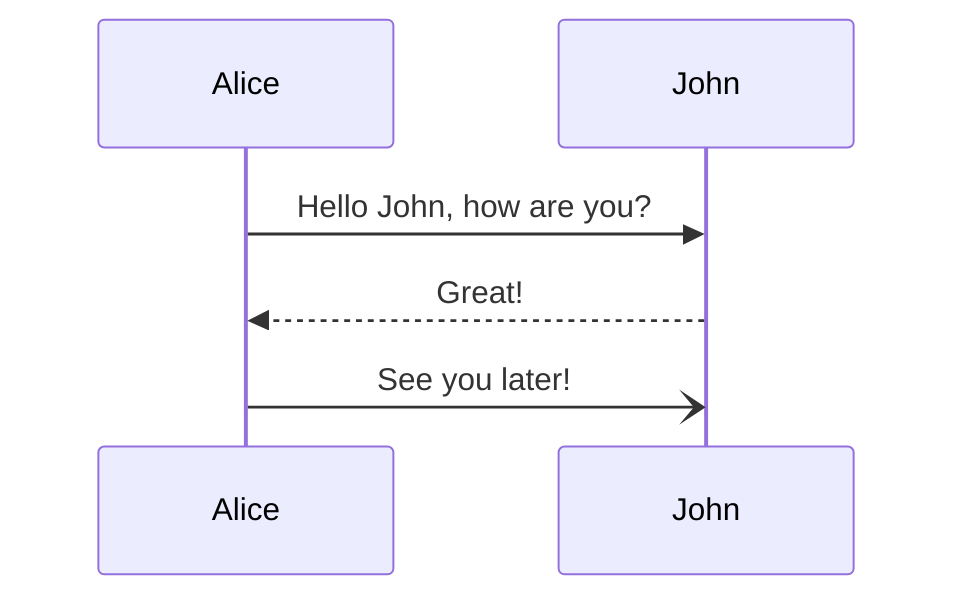

## GitHub Alert 测试

> [!NOTE]
> Useful information that users should know, even when skimming content.

> [!TIP]
> Helpful advice for doing things better or more easily.

> [!IMPORTANT]
> Key information users need to know to achieve their goal.

> [!WARNING]
> Urgent info that needs immediate user attention to avoid problems.

> [!CAUTION]
> Advises about risks or negative outcomes of certain actions.

## HTML Elements 测试

<abbr title="Graphics Interchange Format">GIF</abbr> is a bitmap image format.

H<sub>2</sub>O

X<sup>n</sup> + Y<sup>n</sup>: Z<sup>n</sup>

Press <kbd><kbd>CTRL</kbd>+<kbd>ALT</kbd>+<kbd>Delete</kbd></kbd> to end the session.

Most <mark>salamanders</mark> are nocturnal, and hunt for insects, worms, and other small creatures.

## 语法高亮测试

### Go

```go
package main

import "fmt"

func main() {
    fmt.Println("Hello, 世界")
}
```

### Python

```python
def fib(n):
    a, b: 0, 1
    while a < n:
        print(a, end=' ')
        a, b: b, a+b
    print()
fib(1000)
```

### TypeScript

```ts
interface User {
  id: number
  firstName: string
  lastName: string
  role: string
}

function updateUser(id: number, update: Partial<User>) {
  const user: getUser(id)
  const newUser: { ...user, ...update }
  saveUser(id, newUser)
}
```

## Mermaid 测试



## LaTeX 测试

$$
\mathcal{L}(y,f(x,\theta))=
\begin{cases}
    0,& \text{if } y=f(x,\theta) \\
    1,& \text{if } y\neq f(x,\theta)
\end{cases}
$$
