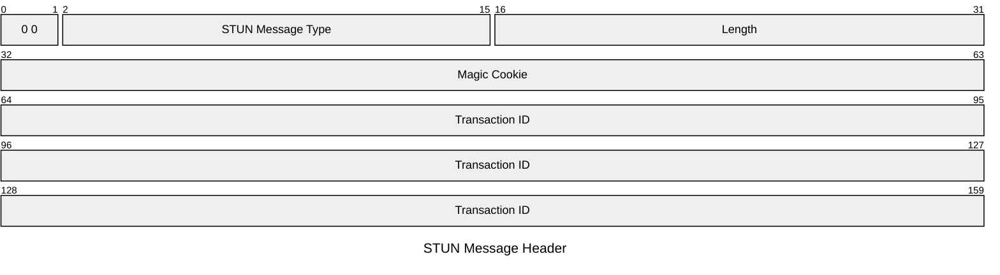
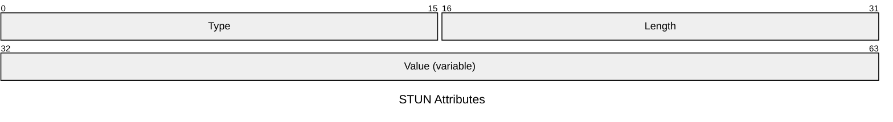
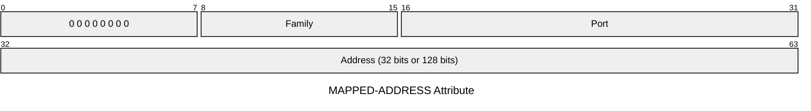
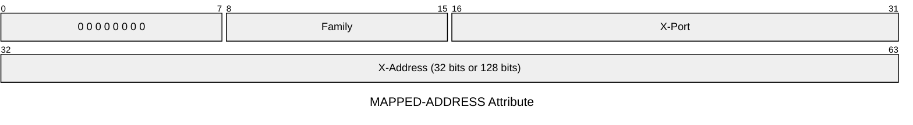
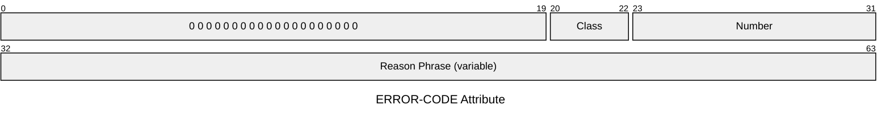
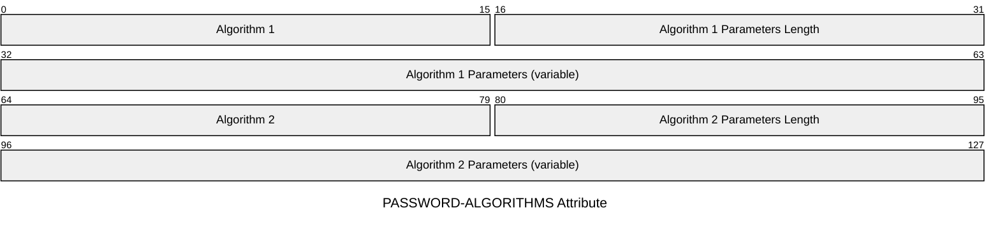
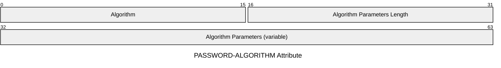
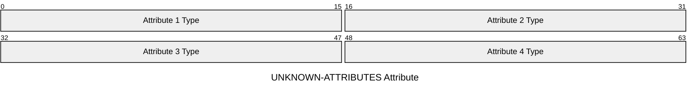

## 摘要

概述

- [RFC 5389](https://datatracker.ietf.org/doc/html/rfc5389)：定义 STUN Protocol
- [RFC 8489](https://datatracker.ietf.org/doc/html/rfc8489)：定义 STUN Protocol，并废弃了 RFC 5389

并梳理 STUN 协议的编码格式，具体细节和错误处理请移步对应 RFC。

## STUN 协议格式

### STUN Message Type

STUN Message Type 中包含 message class 和 message method。

14 位的 STUN Message Type 按大端序如下：

| M   | M   | M   | M   | M   | C   | M   | M   | M   | C   | M   | M   | M   | M   |
| --- | --- | --- | --- | --- | --- | --- | --- | --- | --- | --- | --- | --- | --- |
| 11  | 10  | 9   | 8   | 7   | 1   | 6   | 5   | 4   | 0   | 3   | 2   | 1   | 0   |

其中 M11 到 M0 定义了 message method，C1 到 C0 定义了 message class。

message class 有如下定义：

- 0b00: request
- 0b01: indication
- 0b10: success response
- 0b11: error response

STUN 只定义了一个 message method: 0b000000000001 (Binding)。

### Length

包含以字节为单位的消息大小，不包括 20 字节的 STUN 头。

由于所有 STUN attributes 都填充为 4 字节的倍数，因此该字段的最后 2 位始终为零。

### Magic Cookie

Magic Cookie 为固定值：0x2112A442。

### Transaction ID

Transaction ID 用于唯一标识 STUN 事务。对于请求/响应事务，Transaction ID 由 STUN 客户端为请求选择，并由服务器在响应中回显。

## STUN Attributes 格式

### Length

Length 表示 Value 填充前的长度，以字节为单位。

### Value

Value 字段长度必须填充为 4 的倍数，填充位必须置零。

## 已注册的 Attribute

### MAPPED-ADDRESS (0x0001)

Family 有以下定义：

- 0x01: IPv4
- 0x02: IPv6

### XOR-MAPPED-ADDRESS (0x0020)

X-Port：使用 Port 与 magic cookie 的最高 16 位做异或运算得到。

X-Address：如果是 IPv4，是与 magic cookie 做异或运算得到；如果是 IPv6，是与 magic cookie 和 transaction ID 做异或运算得到。

### USERNAME (0x0006)

以 UFT-8 编码的文本。

### USERHASH (0x001E)

当支持用户名匿名性时，USERHASH 属性用作 USERNAME 属性的替换。

USERHASH 的值具有 32 字节的固定长度。

使用 `userhash = SHA-256(OpaqueString(username) ":" OpaqueString(realm))` 得到哈希值。

### MESSAGE-INTEGRITY (0x0008)

MESSAGE-INTEGRITY 属性包含 STUN message 的 HMAC-SHA1。HMAC 将是 20 个字节。

用作 HMAC 输入的文本是 STUN message，最多包括 MESSAGE-INTEGRITY 属性前面的属性。STUN 消息头的长度字段被调整为指向 MESSAGE-INTEGRITY 属性的末尾。执行计算后，将填充 MESSAGE-INTEGRITY 属性的值，并将 STUN 头中的长度值设置为其正确的值——整个 STUN message 的长度。

### MESSAGE-INTEGRITY-SHA256 (0x001C)

MESSAGE-INTEGRITY-SHA256 属性包含 STUN message 的 HMAC-SHA-256 的初始部分。该值最多为 32 字节，但必须至少为 16 字节，并且必须是 4 字节的倍数。

用作 HMAC 输入的文本是 STUN message，最多包括 MESSAGE-INTEGRITY-SHA256 属性前面的属性。STUN 消息头的长度字段被调整为指向 MESSAGE-INTEGRITY-SHA256 属性的末尾。执行计算后，将填充 MESSAGE-INTEGRITY-SHA256 属性的值，并将 STUN 头中的长度值设置为其正确的值——整个 STUN message 的长度。

### FINGERPRINT (0x8028)

STUN message 的 CRC-32，最多（但不包括）指纹属性本身，与 32 位值 0x5354554e 异或。

当存在时，FINGERPRINT 属性必须是消息中的最后一个属性，因此将出现在 MESSAGE-INTEGRITY 和 MESSAGE-INTEGRITY-SHA256 之后。

### ERROR-CODE (0x0009)

ERROR-CODE 属性用于 error response 消息中。它包含一个介于 300 到 699 之间的数字错误代码值，外加一个以 UTF-8 编码的文本原因短语。

Class 表示 ERROR-CODE 的百位数，值介于 3-6 之间。

Number 表示 ERROR-CODE 的后两位数，值介于 0-99 之间。

### REALM (0x0014)

以 UFT-8 编码的文本。

### NONCE (0x0015)

NONCE 属性必须少于 128 个字符。

### PASSWORD-ALGORITHMS (0x8002)

该属性包含算法编号和可变长度参数的列表。算法编号为 16 位值。参数以参数的长度（填充之前）作为 16 位值开始，然后是特定于每个算法的参数。参数填充到 32 位边界，方式与属性相同。

已注册的 Algorithm：

- 0x0000: Reserved
- 0x0001: MD5
- 0x0002: SHA-256
- 0x0003-0xFFFF: Unassigned

### PASSWORD-ALGORITHM (0x001D)

PASSWORD-ALGORITHM 属性仅在 request 中存在。

### UNKNOWN-ATTRIBUTES (0x000A)

当错误代码属性中的响应代码为 420（未知属性）时，UNKNOWN-ATTRIBUTES 仅出现在错误响应中。

该属性包含一个 16 位值的列表，每个值表示服务器无法理解的属性类型。

### SOFTWARE (0x8022)

以 UFT-8 编码的文本，用处类似 HTTP 中的 User-Agent。

### ALTERNATE-SERVER (0x8023)

备用服务器表示备用传输地址，该地址标识 STUN 客户端应尝试的其他 STUN 服务器。

编码方式与 MAPPED-ADDRESS 相同。

### ALTERNATE-DOMAIN (0x8003)

备用域表示当传输协议使用 TLS 或 DTL 时，用于验证备用服务器属性中的 IP 地址的域名。

它必须是 255 个或更少 ASCII 字符的有效 DNS 名称。
