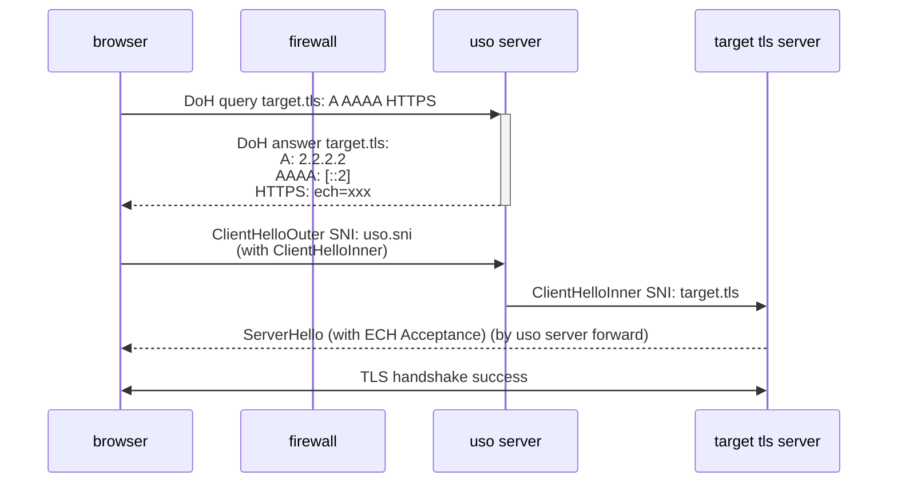

## ECH

如今，HTTPS (TLS) 加密了互联网上绝大多数内容，这确保普通人上网浏览的内容不被中间人窃听和篡改 (国内用户可能还记得以前 ISP 在页面内贴小广告的勾当，但在 HTTPS 大规模普及后几乎绝迹)

然而 TLS 仍然保留了 SNI (服务器名称指示)，由于 TLS 协商中客户端需要证书验证服务器身份，而服务器也需要根据客户端想访问的域发送证书，SNI 仍然显露在外不受加密保护，这使得防火墙依据 SNI 阻止用户访问某类域成为可能

不过，名为 Encrypted Client Hello (ECH) [^1]的新技术有望解决这一问题，ECH 遮掩了用于协商 TLS 握手的 SNI，通过 DNS 查询 HTTPS 记录提前获取公钥，加密 SNI 等 TLS 握手中的敏感信息，使中间人再无可乘之机

然而，ECH 目前除了 Cloudflare 外均无大规模部署，实际落地仍然遥遥无期

> [!NOTE]
> Cloudflare 部署的 ECH 的外显 SNI 均为 `cloudflare-ech.com`，虽然 ECH 禁止回退为普通 TLS 握手，但防火墙也可完全阻断该 SNI 使 ECH 握手失败，迫使用户自愿选择降级

## 「uso」

「uso」可使用户使用 ECH 访问**未部署 ECH** 的服务器，受 ECH 保护 SNI，以绕过防火墙

### 关于「uso」

> [!TIP] uso 是什么意思？
> uso 即为「<ruby>嘘<rt>うそ</rt></ruby>」

- 「uso」不是一种协议
  - 「uso」没有定义任何编码表示，其完全基于标准协议
  - 「uso」不是 TLS tunnel，因此不存在 TLS in TLS
- 「uso」是仅服务端的
  - TLS 由浏览器直接发起，不存在可区分性特征
- 当前，「uso」不具有实际应用价值

### 「uso」的定义

如 ECH 草案 3.1 节[^2] 中介绍，ECH 分为「Shared Mode」和「Split Mode」

在「Split Mode」中，「Client-Facing Server」接受 ClientHelloOuter 并解密其中的 ClientHelloInner，随后将 ClientHelloInner 转发至「Backend Server」

若「Backend Server」按照 ECH 草案 6.1.4 节[^3] 接受 ClientHelloInner，「Backend Server」即与「Client」完成握手

在以上过程中，「uso」将充当「Client-Facing Server」以及「Client」的「DNS Server」

「uso」作为「Client」的 DNS Server，将任意 target 解析至「uso」充当的「Client-Facing Server」，随后「uso」接受 ClientHelloOuter 并解密其中的 ClientHelloInner，根据 ClientHelloInner 中的真实 SNI 转发至真正的 target server

> [!TIP]
> 在上述过程中，ClientHelloOuter 中的 SNI (以下简称 public name) 由 HTTPS 记录控制，而「uso」充当「Client」的「DNS Server」可生成任意 HTTPS 记录，因此 public name 是任意可变的，防火墙只能查看 public name，无法知道真实 SNI，只能选择放行

## 实现

我实现了「uso」，作为其概念的验证，仓库 [在这](https://github.com/jiang-zhexin/uso)

为作区分，本文中「uso」表示定义，uso 仅表示该仓库内的实现

uso 的通信模型如下：

> 假定 uso server 的 IP 为 2.2.2.2 和 ::2，target tls server 的域名为 target.tls，配置的 public name 为 uso.sni

> [!IMPORTANT]
> 由于 Chrome 和 Firefox 的不良行为（联网测试），会以 `www.google.com` 作为 SNI 的 ClientHello 发送至 uso server，导致 Client 至 uso server 空路由  
> 因此 uso 屏蔽了 *.google.com. 的 DNS 查询

### DEMO

作为试验，我建立了一个 DEMO 节点，使用方法如下：

1. 关闭代理环境
2. 确保浏览器支持 ECH 并启用 ECH
3. 在浏览器内设置安全 DNS 为：`https://uso.zhexin.org/dns-query`，并重启浏览器（刷新 DNS cache）
4. 尝试打开 `v2ex.com` 等网站

> [!NOTE]
> 已下线，需要体验可自部署

## 兼容性

「uso」实际上具有很差的兼容性，「Backend Server」需要按照 ECH 草案 6.1.4 节[^3] 接受 ClientHelloInner，而当前绝大部分的 HTTPS Server 没有实现 ECH 草案，因此 uso 只能访问少数网站

根据我的测试，仅有 Google 系、使用 Cloudflare 的网站以及使用 go 1.24+ 建立的 Web 能够完成握手，其他网站均会报 SSL ERROR，而 x 和 pixiv 虽然使用了 Cloudflare，但其重要的静态资源在其他服务器上，实际也无法使用

如果你知道其他可以通过「uso」访问的网站，欢迎告诉我

## FAQ

#### 为什么「uso」可以访问未部署 ECH 的服务器但仍然只支持访问部分服务器？

请注意区分部署和实现 ECH。ECH 并不只有 TLS 实现的部分，还包括 ech.ConfigList 生成轮换以及将它导出到 DNS HTTPS 记录中的部分

只要实现了 ECH 的服务器，如 go 1.24+ 的 TLS 标准库已理解并按照按照 ECH 草案 6.1.4 节[^3] 接受 ClientHelloInner，即使站长完全不了解 ECH 也未配置 ECH，只要使用 go 1.24+ 构建服务器，也可用「uso」进行访问

#### 「uso」支持 HTTP/3 吗

当然！不过 uso 作为概念验证的产物没有实现这一点

#### 「uso」可以使用任意 SNI 吗

当然！在真实部署场景中，「uso」往往使用 DoH、DoT 等方式提供 DNS 服务，public name 既可选择与之相同的 SNI，如此便完全无法区分二者，又可任意指定 SNI，甚至可以随时间轮换

实际上，你还可以将「DNS Server」和「Client-Facing Server」放置在不同服务器上，「Client-Facing Server」也可以不止一台

[^1]: [Encrypted Client Hello - 隐私的最后一个组成部分](https://blog.cloudflare.com/zh-cn/announcing-encrypted-client-hello)
[^2]: [ECH 草案 3.1 节](https://www.ietf.org/archive/id/draft-ietf-tls-esni-25.html#section-3.1)
[^3]: [ECH 草案 6.1.4 节](https://www.ietf.org/archive/id/draft-ietf-tls-esni-25.html#section-6.1.4)
