由于 TURN 是 STUN 的拓展，因此消息格式遵循 STUN message。建议先阅读我上一篇[介绍 STUN 的文章](/posts/stun-protocol)。

## 摘要

概述

- [RFC 5766](https://datatracker.ietf.org/doc/html/rfc5766)：定义 TURN Protocol
- [RFC 6062](https://datatracker.ietf.org/doc/html/rfc6062)：定义 TURN Protocol 的 TCP 拓展
- [RFC 6156](https://datatracker.ietf.org/doc/html/rfc6156)：定义 TURN Protocol 的 IPv6 拓展
- [RFC 7443](https://datatracker.ietf.org/doc/html/rfc7443)：定义 TURN Protocol 的 ALPN
- [RFC 8656](https://datatracker.ietf.org/doc/html/rfc8656)：定义 TURN Protocol，并废弃了 RFC 5766 和 RFC 6156

并梳理 TURN 协议主要的通信过程，具体细节和错误处理请移步对应 RFC

## 术语

1. **TURN**: TURN 客户端和 TURN 服务器之间使用的协议。它是 STUN 协议 [RFC8489](https://datatracker.ietf.org/doc/html/rfc8489) 的扩展。该协议允许客户端分配和使用中继传输地址。
2. **TURN client**: 实现本规范的 STUN 客户端。
3. **TURN server**: 实现本规范的 STUN 服务器。它在 TURN 客户端及其对等方之间中继数据。
4. **Peer**: TURN 客户端希望与其通信的主机。TURN 服务器在 TURN 客户端及其对等方之间中继流量。对等方不使用本文档中定义的协议与 TURN 服务器交互；相反，对等方接收 TURN 服务器发送的数据，并且对等方向 TURN 服务器发送数据。
5. **Transport Address**: IP 地址和端口的组合。
6. **Host Transport Address**: 客户端或 Peer 的 Transport Address。
7. **Server-Reflexive Transport Address**: 由 NAT 防火墙分配 Transport Address。
8. **Relayed Transport Address**: TURN 服务器上的 Transport Address，用于在客户端和 Peer 之间中继数据包。Peer 向 TURN 服务器上的此地址发送，然后数据包被中继到客户端。
9. **TURN Server Transport Address**: TURN 服务器上的 Transport Address，用于向服务器发送 TURN 消息。这是客户端用于与服务器通信的 Transport Address。
10. **Peer Transport Address**: 服务器看到的 Peer 的 transport address。
11. **Allocation**: 通过 Allocate 请求授予客户端的 Relayed Transport Address，以及相关状态，例如 permission 和过期计时器。
12. **5-tuple**: 客户端 IP 地址和端口、服务器 IP 地址和端口以及 Transport Protoco（目前为 UDP、TCP、DTLS/UDP 或 TLS/TCP）的组合，用于在客户端和服务器之间进行通信。该 5 元组唯一标识此通信流。该 5 元组也唯一标识服务器上的分配。
13. **Transport Protocol**: UDP、TCP、TLS、DTLS。
14. **Channel**: 通道号和关联的 Peer Transport Address。一旦通道号绑定到 Peer Transport Address，客户端和服务器就可以使用更节省带宽的 ChannelData 消息来交换数据。
15. **Permission**: 允许向 TURN 服务器发送流量并将其中继到 TURN 客户端的 Peer 的 IP 地址和传输协议（但不是端口）。TURN 服务器只会将流量从与现有权限匹配的 Peer 转发到其客户端。
16. **Realm**: 用于描述服务器或服务器内上下文的字符串。Realm 告诉客户端使用哪个用户名和密码组合来验证请求。

## UDP 下典型的通信模式

### 模型

```plaintext
                                    Peer A
                                    Server-Reflexive    +---------+
                                    Transport Address   |         |
                                    192.0.2.150:32102   |         |
                                        |              /|         |
                      TURN              |            / ^|  Peer A |
   Client's           Server            |           /  ||         |
   Host Transport     Transport         |         //   ||         |
   Address            Address           |       //     |+---------+
198.51.100.2:49721  192.0.2.15:3478     |+-+  //     Peer A
           |            |               ||N| /       Host Transport
           |   +-+      |               ||A|/        Address
           |   | |      |               v|T|     203.0.113.2:49582
           |   | |      |               /+-+
+---------+|   | |      |+---------+   /              +---------+
|         ||   |N|      ||         | //               |         |
| TURN    |v   | |      v| TURN    |/                 |         |
| Client  |----|A|-------| Server  |------------------|  Peer B |
|         |    | |^      |         |^                ^|         |
|         |    |T||      |         ||                ||         |
+---------+    | ||      +---------+|                |+---------+
               | ||                 |                |
               | ||                 |                |
               +-+|                 |                |
                  |                 |                |
                  |                 |                |
         Client's                   |             Peer B
         Server-Reflexive     Relayed             Transport
         Transport Address    Transport Address   Address
         192.0.2.1:7000       192.0.2.15:50000    192.0.2.210:49191
```

来看一下 TURN 典型的通信过程。

### Allocate

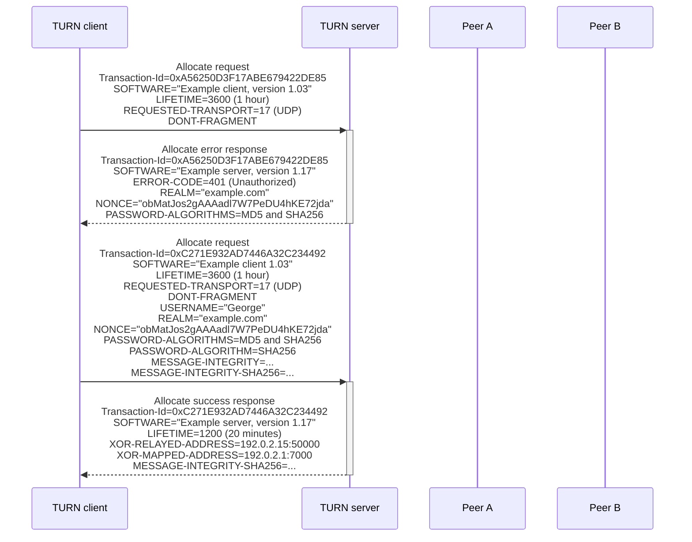

Allocate 可以简单理解为握手，主要用途是在 TURN server 创建一个 UDP 监听（Relayed Transport Address），用于之后的通信。

### Permission

为什么会设计 Permission？因为 TURN server 不会无脑的将 Relayed Transport Address 收到的数据包转发回 TURN client。

一个 allocation 可以有零个或多个 permission。每个 permission 由一个 IP address 和一个 lifetime 组成。当服务器在 allocation's relayed transport address 上收到 UDP 数据报时，它首先检查 permission 列表。如果数据报的源 IP 地址与 permission 匹配，则应用程序数据被中继到客户端；否则，UDP 数据报被静默丢弃。

如果 permission 未刷新，它将在 5 分钟后过期，并且无法明确删除权限。选择此行为是为了匹配符合 RFC 4787 的 NAT 的行为。

客户端可以使用 CreatePermission 请求或 ChannelBind 请求安装或刷新 permission。使用 CreatePermission 请求，可以一次性安装或刷新多个 permission。

请注意，permission 是在 allocation 的上下文中，因此在一个 allocation 中添加或过期 permission 不会影响其他 allocation。

下面是 CreatePermission 通信过程。

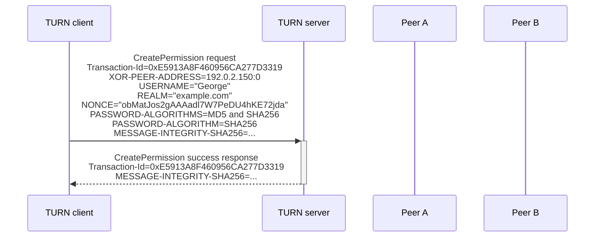

Permission 是针对 IP 地址的，因此 XOR-PEER-ADDRESS=192.0.2.150:0 中的端口设为 0，但是 TURN server 即使收到不为 0 的端口，也同样将整个 IP 列入 Permission 列表中。

### Send Mechanism

一旦创建 permission，就可以使用 Send indication 发送数据包，并且在 Data indication 上接受数据包

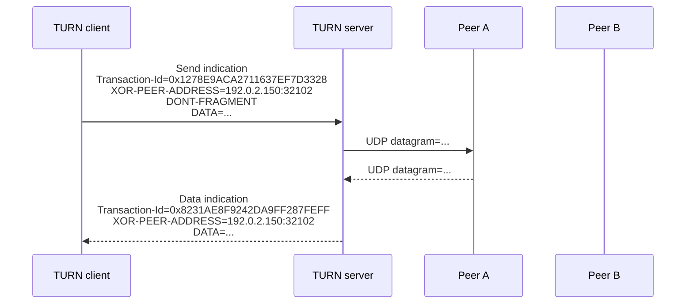

注意到这里的 Transaction-Id 并不相同，因为这两次传输并不是一问一答的，UDP（或 TCP）都允许一方不停发送而另一方完全沉默（只考虑 payload，不考虑 TCP 的 ACK 等）

而对于 Allocate request/Allocate success response 则是类似 HTTP 的一问一答形式，由于底层传输可能使用 UDP，必须使用一对相同的 Transaction-Id 的来标识这对 req/resp，以表明对应关系，也可在超时重试时的验证幂等关系

### Channels

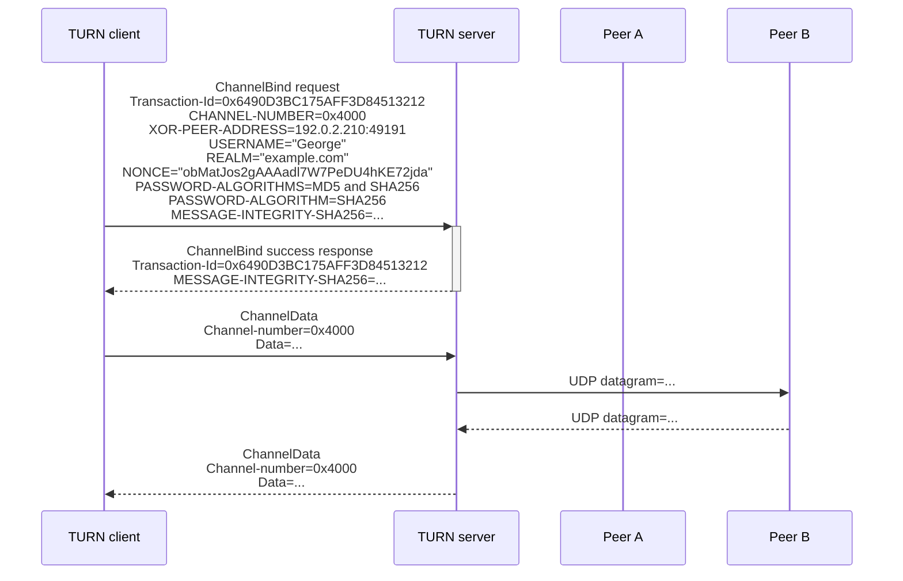

为什么需要使用 Channel？因为 TURN 头部很长，在中继时如不分片容易超过 MTU 所允许的长度。而 ChannelData 不是 STUN message，其头部长度较短。

一旦 channel 绑定，client 可以自由地混合 ChannelData 消息和 Send indication。在图中，client 后来决定使用 Send indication 而不是 ChannelData 消息向 Peer A 发送额外数据。client 可能决定这样做，例如，以便它可以使用 DONT-FRAGMENT 属性。但是，一旦通道绑定，server 将始终使用 ChannelData 消息。

ChannelBind 生命周期持续 10 分钟。但是 TURN 客户端可以通过再次发送 ChannelBind 请求将通道重新绑定到同一 Peer（Peer B 的 IP 地址）来刷新绑定。服务器处理 ChannelBind 请求，将通道重新绑定到同一 Peer，并将过期计时器重置回 10 分钟。

### Refresh

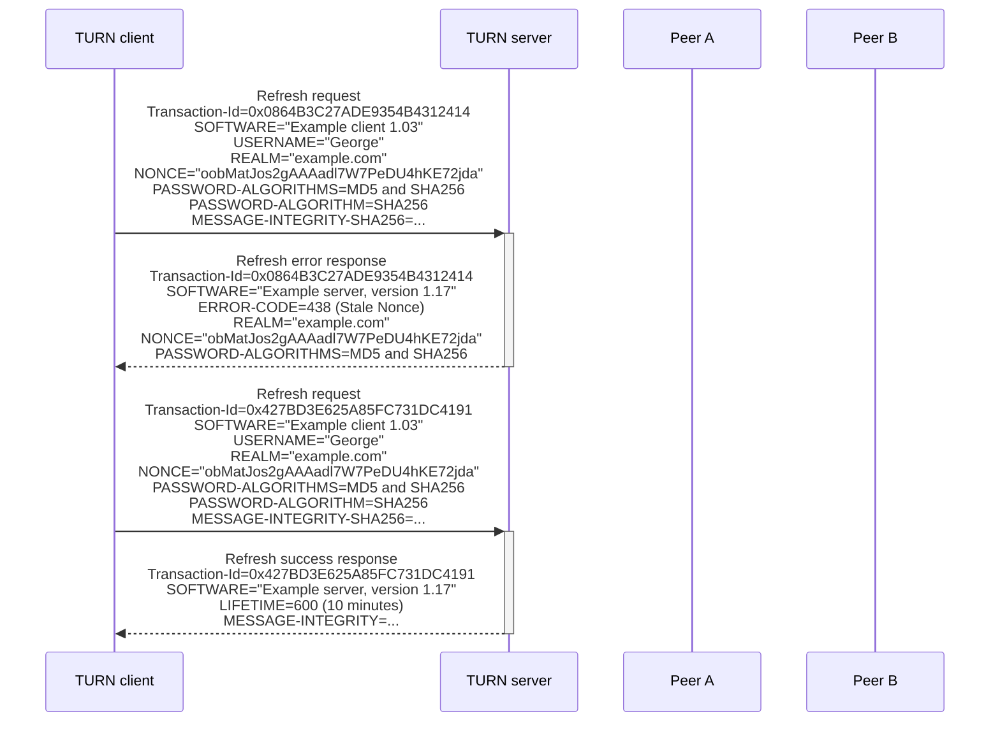

在 20 分钟的生命周期结束之前，客户端刷新 Allocate。这是通过 Refresh request 完成的。与之前一样，客户端在请求中包含最新的 USERNAME、REALM 和 NONCE。客户端还包含 SOFTWARE 属性，遵循在 Allocate 和 Refresh 消息中始终包含此属性的推荐做法。当服务器收到 Refresh request 时，它注意到 NONCE 已过期，因此回复 438 (Stale Nonce) 错误，并提供新的 NONCE。客户端然后重新尝试请求，这次使用新的 NONCE。第二次尝试被接受，服务器回复一个成功响应。请注意，客户端未在请求中包含 LIFETIME 属性，因此服务器将分配刷新为默认生命周期 10 分钟（如成功响应中的 LIFETIME 属性所示）。

## TCP 下典型的通信模式

### 模型

```plaintext
                                                      +--------+
                                                      |        |
                                                      | Peer1  |
                                                   /  |        |
                                                  /   |        |
                                                 /    +--------+
                                                /
                                               /
                                              / Peer Data 1
                                             /
      +--------+  Control       +--------+  /
      |        | -------------- |        | /
      | Client | Client Data 1  | TURN   |
      |        | -------------- | Server | \
      |        | -------------- |        |  \
      +--------+ Client Data 2  +--------+   \
                                              \
                                               \
                                                \     +--------+
                                                 \    |        |
                                      Peer Data 2 \   | Peer2  |
                                                   \  |        |
                                                      |        |
                                                      +--------+
```

注意到 TCP 多了 Control 连接和 Data 连接的概念，说明 TURN client 和 TURN server 的交互大多发生在 Control 连接上，而 TURN client 与 Peer 间的数据传输发生在 Data 连接上。

TURN client 和 TURN server 的通信使用 TCP（TLS），不使用 UDP。

### Allocate

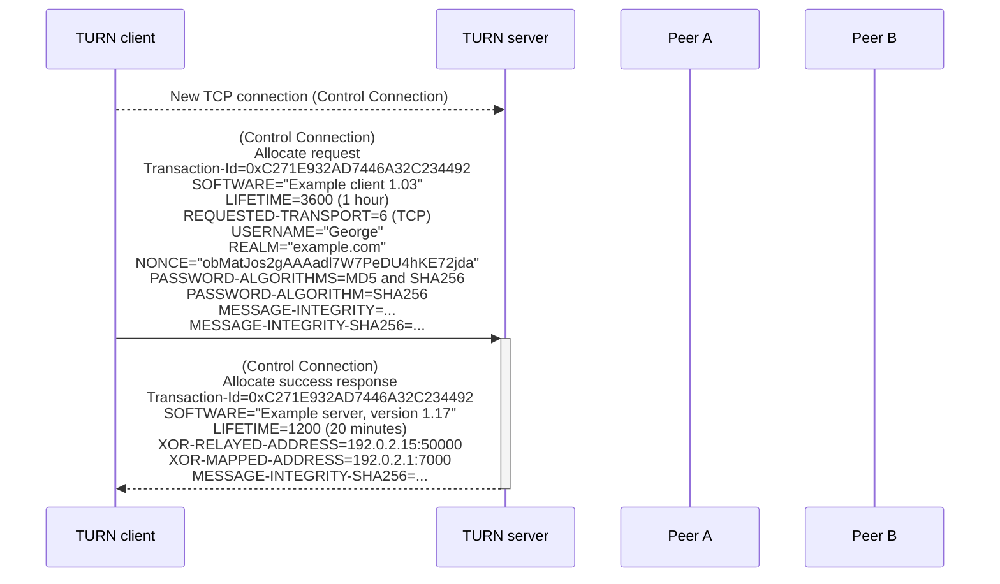

### Connect request

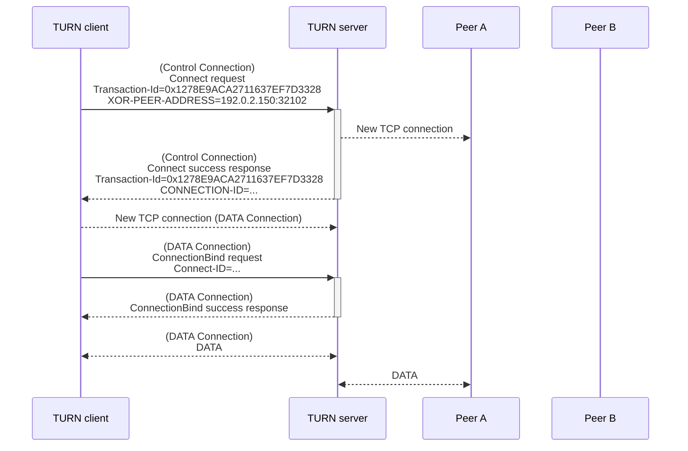

当中继的两个 TCP 任意一个关闭时，TURN server 必须同时关闭另一个。

### Receiving a Connection

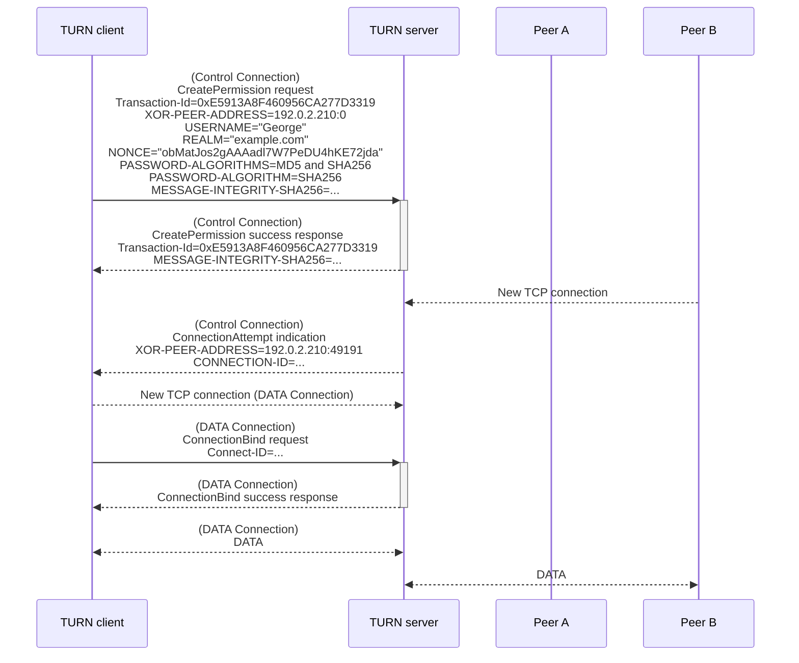

如果没有为此 Allocate 安装对此 Peer 的 Permission，则服务器必须在接受该 Peer 后立即关闭与该 Peer 的连接。

### Refresh

同 UDP Refresh，通过 Control 连接发送。

## TURN URI 方案语义

| TURN client to TURN server | URI                                |
| -------------------------- | ---------------------------------- |
| UDP                        | turn:turn.host:3478?transport=udp  |
| TCP                        | turn:turn.host:3478?transport=tcp  |
| TLS-over-TCP               | turns:turn.host:5349?transport=tcp |
| DTLS-over-UDP              | turns:turn.host:5349?transport=udp |

## ALPN

对于使用 TLS-over-TCP 和 DTLS-over-UDP 的 TURN Protocol，ALPN 应设置为 "stun.turn"

## 新注册的 STUN Methods

- 0x003: Allocate
- 0x004: Refresh
- 0x006: Send
- 0x007: Data
- 0x008: CreatePermission
- 0x009: ChannelBind

- 0x000a: Connect
- 0x000b: ConnectionBind
- 0x000c: ConnectionAttempt

## 新注册的 STUN Attributes

### CHANNEL-NUMBER (0x000c)

该属性的值部分长度为 4 字节，由一个 16 位无符号整数组成，后跟一个两个八位 RFFU（保留供将来使用）字段，该字段在传输时必须设置为 0，在接收时必须忽略。

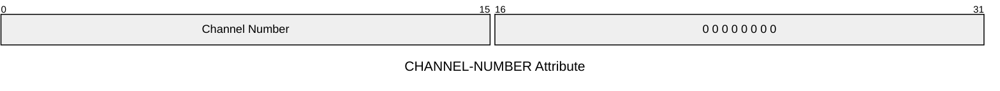

### LIFETIME (0x000d)

LIFETIME 属性表示在没有刷新的情况下服务器将维持分配的持续时间。此属性的值部分长度为 4 字节，由一个 32 位无符号整数值组成，该值表示过期前剩余的秒数。

### XOR-PEER-ADDRESS (0x0012)

编码方式与 [XOR-MAPPED-ADDRESS](/posts/stun-protocol/#xor-mapped-address-0x0020) 相同。

### DATA (0x0013)

此属性的值部分是可变长度的。如果此属性的长度不是 4 的倍数，则必须在此属性后添加填充。

### XOR-RELAYED-ADDRESS (0x0016)

编码方式与 [XOR-MAPPED-ADDRESS](/posts/stun-protocol/#xor-mapped-address-0x0020) 相同。

### EVEN-PORT (0x0018)

此属性允许客户端请求中继传输地址中的端口为偶数，并且（可选）服务器保留下一个更高的端口号。此属性的值部分的长度为 1 字节。其格式为：

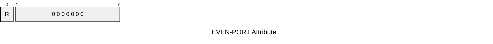

R：如果为 1，则请求服务器保留下一个更高的端口号（在同一 IP 地址上），以供后续分配。如果为 0，则不请求此类预订。

### REQUESTED-TRANSPORT (0x0019)

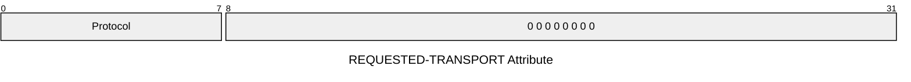

Protocol: 为 17 (UDP) 或 6 (TCP)

### DONT-FRAGMENT (0x001a)

客户端使用此属性请求服务器在将应用程序数据转发给对等方时在 IP 头中设置 DF（不分段）位。此属性没有值部分，因此属性长度字段为 0。

### RESERVATION-TOKEN (0x0022)

RESERVATION-TOKEN 属性包含一个令牌，该令牌唯一标识服务器保留的中继传输地址。服务器在成功响应中包含此属性以告知客户端令牌，客户端在后续分配请求中包含此属性以请求服务器使用该中继传输地址进行分配。

属性值为 8 字节，包含令牌值。

### CONNECTION-ID (0x002a)

它是一个 32 位无符号整数值。

## 参考

- [RFC 5766 中文](https://rfc2cn.com/rfc5766.html)
- [RFC 6062 中文](https://rfc2cn.com/rfc6062.html)
- [RFC 6156 中文](https://rfc2cn.com/rfc6156.html)
